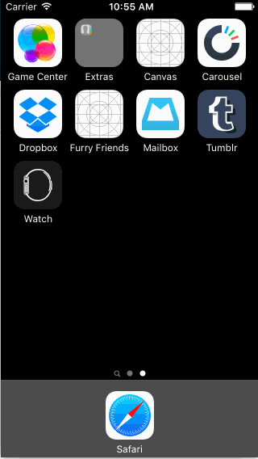

# Tumblr Prototype

Homework for CodePath, [Week 4 Project: Tumblr](http://courses.codepath.com/courses/ios_for_designers/unit/4#!assignment)

## Summary
* This project took about **6 hours** to complete, over 3 sessions.
* **All required** steps are complete.
* **Some optional** steps are complete. ([see requirements](#requirements))

## Demo

<!-- ## Main Storyboard -->
<!--  -->

## Requirements
- [x] Tapping on Home, Search, Account, or Trending should show the respective screen and highlight the tab bar button.
- [x] Compose button should modally present the compose screen.
- [x] Optional: Compose screen is faded in while the buttons animate in.
- [x] Optional: Login button should show animate the login form over the view controller.
- [ ] Optional: Discover bubble should bob up and down unless the SearchViewController is tapped.
